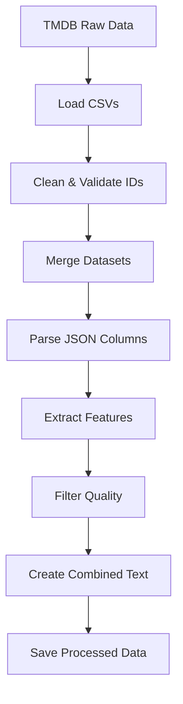

# Processamento de Dados

Documentação completa sobre o pipeline de processamento de dados do TMDB.

## Visão Geral

O sistema processa dados brutos do TMDB (The Movie Database) e os transforma em um formato otimizado para o algoritmo de recomendação. O processo envolve limpeza, extração de features, e criação de representações textuais combinadas.

## Pipeline de Dados



## Datasets de Entrada

### 1. movies_metadata.csv

Contém metadados principais dos filmes.

**Colunas Principais**:
- `id`: ID único do filme
- `title`: Título do filme
- `overview`: Sinopse/descrição
- `genres`: Gêneros (formato JSON)
- `poster_path`: Caminho do poster
- `vote_average`: Média de votos (0-10)
- `vote_count`: Número de votos
- `popularity`: Score de popularidade
- `production_companies`: Empresas produtoras (JSON)

**Tamanho**: ~45.000 filmes

### 2. credits.csv

Informações sobre elenco e equipe.

**Colunas Principais**:
- `id`: ID do filme (chave estrangeira)
- `cast`: Lista de atores (formato JSON)
- `crew`: Lista da equipe técnica (formato JSON)

**Estrutura do JSON**:
```json
{
  "cast": [
    {
      "name": "Robert Downey Jr.",
      "character": "Tony Stark",
      "order": 0
    },
    ...
  ],
  "crew": [
    {
      "name": "Jon Favreau",
      "job": "Director",
      "department": "Directing"
    },
    ...
  ]
}
```

### 3. keywords.csv

Palavras-chave associadas aos filmes.

**Colunas Principais**:
- `id`: ID do filme (chave estrangeira)
- `keywords`: Lista de palavras-chave (JSON)

**Estrutura do JSON**:
```json
{
  "keywords": [
    {"name": "superhero"},
    {"name": "marvel"},
    {"name": "iron man"}
  ]
}
```

## Processo de Transformação

### 1. Carregamento de Dados

```python
def process_data():
    # Carregar datasets
    meta = pd.read_csv('data/extracted/movies_metadata.csv', 
                       low_memory=False, 
                       on_bad_lines='skip')
    credits = pd.read_csv('data/extracted/credits.csv', 
                          low_memory=False, 
                          on_bad_lines='skip')
    keywords = pd.read_csv('data/extracted/keywords.csv', 
                           low_memory=False, 
                           on_bad_lines='skip')
```

**Parâmetros Importantes**:
- `low_memory=False`: Evita avisos de tipos mistos
- `on_bad_lines='skip'`: Ignora linhas malformadas

### 2. Limpeza de IDs

```python
# Converter IDs para numérico
meta['id'] = pd.to_numeric(meta['id'], errors='coerce')
credits['id'] = pd.to_numeric(credits['id'], errors='coerce')
keywords['id'] = pd.to_numeric(keywords['id'], errors='coerce')

# Remover NaNs
meta = meta.dropna(subset=['id'])
credits = credits.dropna(subset=['id'])
keywords = keywords.dropna(subset=['id'])

# Converter para inteiro
meta['id'] = meta['id'].astype(int)
credits['id'] = credits['id'].astype(int)
keywords['id'] = keywords['id'].astype(int)
```

**Por que isso é necessário?**
- Alguns IDs contêm valores inválidos
- Necessário para merge correto dos datasets

### 3. Merge de Datasets

```python
# Merge metadata com credits
movies = meta.merge(credits, on='id')

# Merge com keywords
movies = movies.merge(keywords, on='id')
```

**Resultado**: Dataset unificado com todas as informações.

### 4. Parse de Colunas JSON

```python
def parse_list(x):
    try:
        if isinstance(x, str):
            return ast.literal_eval(x)
        return []
    except:
        return []

movies['genres'] = movies['genres'].apply(parse_list)
movies['cast'] = movies['cast'].apply(parse_list)
movies['crew'] = movies['crew'].apply(parse_list)
movies['keywords'] = movies['keywords'].apply(parse_list)
movies['production_companies'] = movies['production_companies'].apply(parse_list)
```

**Conversão**: String JSON → Lista Python

### 5. Extração de Features

#### Diretor

```python
def get_director(crew_list):
    for member in crew_list:
        if member.get('job') == 'Director':
            return member.get('name')
    return np.nan

movies['director'] = movies['crew'].apply(get_director)
```

#### Elenco (Top 5)

```python
def get_cast_names(cast_list):
    if isinstance(cast_list, list):
        names = [member.get('name') for member in cast_list]
        return names[:5]  # Top 5 atores
    return []

movies['cast_names'] = movies['cast'].apply(get_cast_names)
```

#### Gêneros

```python
def get_genres(genre_list):
    if isinstance(genre_list, list):
        return [g.get('name') for g in genre_list]
    return []

movies['genre_names'] = movies['genres'].apply(get_genres)
```

#### Keywords (Top 10)

```python
def get_keywords(keyword_list):
    if isinstance(keyword_list, list):
        names = [k.get('name') for k in keyword_list]
        return names[:10]  # Top 10 keywords
    return []

movies['keyword_names'] = movies['keywords'].apply(get_keywords)
```

#### Empresas de Produção

```python
def get_production_companies(companies_list):
    if isinstance(companies_list, list):
        return [c.get('name') for c in companies_list]
    return []

movies['company_names'] = movies['production_companies'].apply(get_production_companies)
```

### 6. Combinação de Keywords

```python
# Combinar keywords originais com empresas de produção
movies['final_keywords'] = movies.apply(
    lambda x: x['keyword_names'] + x['company_names'], 
    axis=1
)
```

**Razão**: Empresas de produção (Marvel, Pixar, etc.) são indicadores importantes de estilo.

### 7. Filtro de Qualidade

#### Filtro de Imagens

```python
# Manter apenas filmes com poster válido
movies = movies[movies['poster_path'].notna()]
movies = movies[movies['poster_path'].apply(
    lambda x: isinstance(x, str) and len(x) > 5
)]
```

#### Criação de URL de Imagem

```python
def format_image_url(path):
    if not isinstance(path, str):
        return ""
    if not path.startswith('/'):
        path = '/' + path
    return f"https://image.tmdb.org/t/p/w500{path}"

movies['image_url'] = movies['poster_path'].apply(format_image_url)
```

**Tamanhos Disponíveis no TMDB**:
- `w92`: 92px de largura
- `w154`: 154px
- `w185`: 185px
- `w342`: 342px
- `w500`: 500px (usado)
- `w780`: 780px
- `original`: Tamanho original

#### Filtro por Votos

```python
# Manter filmes com pelo menos 50 votos
final_df = final_df[final_df['vote_count'] >= 50]
```

**Razão**: Filmes com poucos votos podem ter ratings não confiáveis.

### 8. Seleção e Renomeação de Colunas

```python
final_df = movies[[
    'id', 
    'title', 
    'overview', 
    'genre_names', 
    'image_url', 
    'director', 
    'cast_names', 
    'final_keywords',
    'vote_average', 
    'vote_count',
    'popularity'
]].copy()

final_df.rename(columns={
    'overview': 'description',
    'genre_names': 'genre',
    'cast_names': 'cast',
    'final_keywords': 'keywords'
}, inplace=True)
```

### 9. Tratamento de Valores Nulos

```python
final_df['description'] = final_df['description'].fillna('')
final_df['director'] = final_df['director'].fillna('')
final_df['genre'] = final_df['genre'].apply(
    lambda x: x if isinstance(x, list) else []
)
final_df['cast'] = final_df['cast'].apply(
    lambda x: x if isinstance(x, list) else []
)
final_df['keywords'] = final_df['keywords'].apply(
    lambda x: x if isinstance(x, list) else []
)
```

### 10. Salvamento

```python
final_df.to_csv('data/processed_movies.csv', index=False)
print(f"Saving {len(final_df)} processed movies...")
```

## Formato de Saída

### processed_movies.csv

**Estrutura**:

| Coluna | Tipo | Exemplo |
|--------|------|---------|
| id | int | 299536 |
| title | str | "Avengers: Infinity War" |
| description | str | "The Avengers and their allies..." |
| genre | list[str] | ["Action", "Adventure", "Science Fiction"] |
| image_url | str | "https://image.tmdb.org/t/p/w500/..." |
| director | str | "Anthony Russo" |
| cast | list[str] | ["Robert Downey Jr.", "Chris Hemsworth", ...] |
| keywords | list[str] | ["superhero", "marvel", "infinity stones", ...] |
| vote_average | float | 8.3 |
| vote_count | int | 28000 |
| popularity | float | 150.5 |

**Tamanho Típico**: ~8.000-10.000 filmes (após filtros)

## Estatísticas do Dataset

### Distribuição de Gêneros

```python
# Análise de gêneros mais comuns
from collections import Counter

all_genres = []
for genres in final_df['genre']:
    all_genres.extend(genres)

genre_counts = Counter(all_genres)
print(genre_counts.most_common(10))
```

**Top 10 Gêneros** (típico):
1. Drama (~4000 filmes)
2. Comedy (~2500)
3. Thriller (~2000)
4. Action (~1800)
5. Romance (~1500)
6. Adventure (~1200)
7. Crime (~1000)
8. Science Fiction (~800)
9. Horror (~700)
10. Family (~600)

### Distribuição de Votos

```python
import matplotlib.pyplot as plt

plt.hist(final_df['vote_count'], bins=50)
plt.xlabel('Vote Count')
plt.ylabel('Number of Movies')
plt.title('Distribution of Vote Counts')
plt.show()
```

## Executando o Processador

### Comando Básico

```bash
python backend/data_processor.py
```

### Saída Esperada

```
Loading datasets...
Cleaning IDs...
Merging datasets...
Processing features...
Saving 8547 processed movies...
Done!
```

### Tempo de Execução

- **Dataset completo**: ~30-60 segundos
- **Depende de**: CPU, RAM, tamanho do dataset

## Troubleshooting

### Erro: "File not found"

**Problema**: Arquivos CSV não estão na pasta correta.

**Solução**:
```bash
# Verifique se os arquivos existem
ls data/extracted/

# Devem existir:
# - movies_metadata.csv
# - credits.csv
# - keywords.csv
```

### Erro: "Invalid ID"

**Problema**: IDs malformados no dataset.

**Solução**: O código já trata isso com `errors='coerce'` e `dropna()`.

### Erro: "Memory Error"

**Problema**: Dataset muito grande para RAM disponível.

**Solução**:
```python
# Processar em chunks
chunksize = 10000
for chunk in pd.read_csv('file.csv', chunksize=chunksize):
    process_chunk(chunk)
```

### Dataset vazio após processamento

**Problema**: Filtros muito restritivos.

**Solução**: Ajuste o threshold de `vote_count`:
```python
# Reduzir de 50 para 10
final_df = final_df[final_df['vote_count'] >= 10]
```

## Otimizações

### 1. Usar Parquet ao invés de CSV

```python
# Salvar
final_df.to_parquet('data/processed_movies.parquet')

# Carregar (muito mais rápido)
df = pd.read_parquet('data/processed_movies.parquet')
```

**Vantagens**:
- 5-10x mais rápido para ler
- Menor tamanho de arquivo
- Preserva tipos de dados

### 2. Cache de Processamento

```python
import pickle

# Salvar estado intermediário
with open('cache/merged_data.pkl', 'wb') as f:
    pickle.dump(movies, f)

# Carregar
with open('cache/merged_data.pkl', 'rb') as f:
    movies = pickle.load(f)
```

## Atualizando os Dados

Para atualizar com novos dados do TMDB:

1. Baixe os datasets atualizados
2. Substitua os arquivos em `data/extracted/`
3. Execute o processador novamente
4. Reinicie o backend

```bash
python backend/data_processor.py
cd backend
python main.py
```

## Próximos Passos

- 📖 [Documentação da API](api.md)
- 🎨 [Documentação do Frontend](frontend.md)
- 🤝 [Como Contribuir](contributing.md)

---

!!! info "Fonte dos Dados"
    Os datasets do TMDB podem ser baixados em: [Kaggle - The Movies Dataset](https://www.kaggle.com/datasets/rounakbanik/the-movies-dataset)
