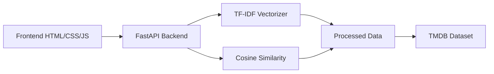

# Bem-vindo ao NetRecs 🎬

Sistema inteligente de recomendação de filmes baseado em similaridade de conteúdo.


## O que é o NetRecs?

O **NetRecs** é um sistema de recomendação de filmes que utiliza técnicas avançadas de **Processamento de Linguagem Natural (NLP)** e **Aprendizado de Máquina** para encontrar filmes similares baseados em múltiplos fatores.

### Principais Características

- ✨ **Recomendações Inteligentes**: Algoritmo baseado em TF-IDF e similaridade de cosseno
- 🎨 **Interface Moderna**: Design inspirado em plataformas de streaming
- 🔍 **Busca Avançada**: Pesquisa por título, gênero, diretor, atores ou palavras-chave
- 📊 **Múltiplos Filtros**: Navegação por gêneros com filmes populares
- ⚡ **API RESTful**: Backend FastAPI de alto desempenho

## Início Rápido

### Instalação

```bash
# Clone o repositório
git clone https://github.com/seu-usuario/sistema-de-recomendacao-de-filme.git
cd sistema-de-recomendacao-de-filme

# Instale as dependências
pip install -r backend/requirements.txt

# Inicie o servidor
cd backend
python main.py
```

### Primeiro Uso

1. Abra `frontend/index.html` no navegador
2. Digite o que você procura (ex: "superhero action")
3. Veja as recomendações com scores de similaridade!

## Arquitetura



## Tecnologias Utilizadas

### Backend
- **Python 3.8+**
- **FastAPI**: Framework web moderno
- **Pandas**: Manipulação de dados
- **Scikit-learn**: Machine Learning
- **NLTK**: Processamento de linguagem natural

### Frontend
- **HTML5/CSS3**
- **JavaScript (Vanilla)**
- **Google Fonts**

## Como Funciona?

O sistema funciona em 5 etapas principais:

1. **Processamento de Dados**: Extração e limpeza de dados do TMDB
2. **Criação de Features**: Combinação de atributos com pesos otimizados
3. **Vetorização TF-IDF**: Conversão de texto em vetores numéricos
4. **Cálculo de Similaridade**: Comparação usando similaridade de cosseno
5. **Normalização**: Ajuste dos scores para escala 0-95%

!!! tip "Dica"
    Para melhores resultados, use palavras-chave específicas como "superhero", "space adventure", ou "romantic comedy"!

## Próximos Passos

- 📖 [Guia de Instalação Completo](installation.md)
- 🔌 [Documentação da API](api.md)
- 🎨 [Documentação do Frontend](frontend.md)
- 📊 [Processamento de Dados](data-processing.md)
- 🤝 [Como Contribuir](contributing.md)

## Suporte

Se você encontrar algum problema ou tiver dúvidas:

- 🐛 [Reporte um bug](https://github.com/seu-usuario/sistema-de-recomendacao-de-filme/issues)
- 💡 [Sugira uma feature](https://github.com/seu-usuario/sistema-de-recomendacao-de-filme/issues)
- 📧 Entre em contato com a equipe

---

⭐ **Gostou do projeto?** Dê uma estrela no GitHub!
